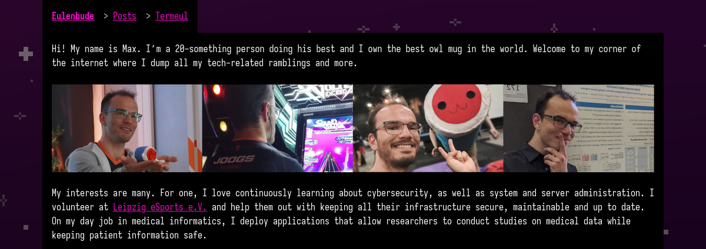

+++
title = 'Home'
date = 2023-01-01T08:00:00-07:00
draft = false
+++

Termeul is a simple, minimal and beautiful [Hugo](https://gohugo.io/) theme.
I created it for [Eulenbude](https://eulenbu.de) which is my personal website.

Termeul is pronounced like "turmoil" and is composed of "term", which is short for "terminal", and "eul", which is the German word for "owl" with the last letter missing.
It is greatly inspired by [Risotto](https://github.com/joeroe/risotto).
A lot of its core components have been carried over and slightly modified.

If you like simple themes with very little fluff, then Termeul might be for you.
[Check it out on GitHub.](https://github.com/JoogsWasTaken/termeul)
